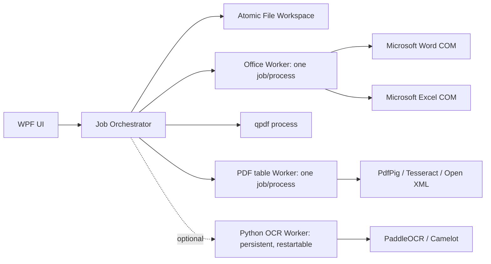
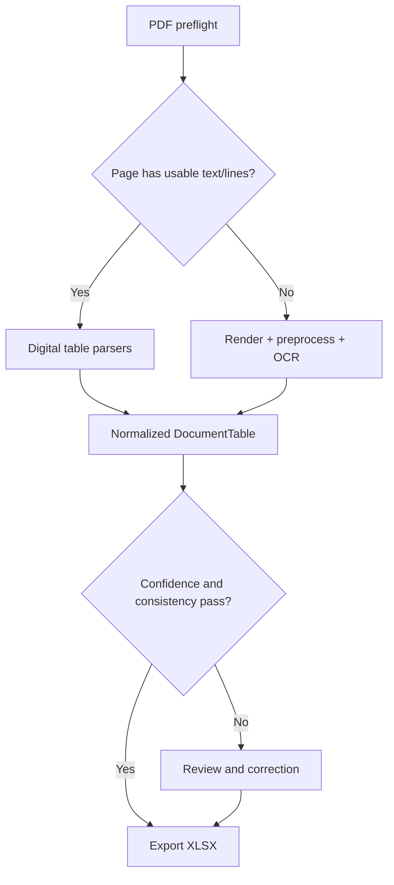

# 文枢 / DocPivot 项目设计

> 文枢是一款以本地、批量、可复核为核心的 Windows 文档处理工作台。本文档同时承担需求基线、架构决策、工程约束、验收标准和项目进度清单的职责。

- 文档版本：`0.14.0-dev`
- 最后更新：`2026-08-05`
- 当前阶段：Milestone B 基线闭环完成；PDF/Excel 工具、批量重命名和 PDF 转 Excel 首个可用闭环完成，进入复杂版面与通用体验增强
- 决策状态：ADR-001/002/003/004 已批准，重型 OCR/PDF 引擎按验证门禁逐项引入
- 工作区状态：M1 工程基础设施完成；OfficeWorker 已通过 Word/Excel 原生 PDF 导出验证；PDF 工作台已完成密码预检、缩略图剪切拆分、可选 ZIP、qpdf 无损优化及 Ghostscript 有损压缩保真门禁；批量重命名已完成预览、四种编辑模式、安全事务与撤销闭环；Excel 工具已完成独立进程隔离、兼容性预检、工作表级合并拆分、跨表公式外链化、媒体保真压缩、XLS 保留/转换和真实 Office 保真矩阵；PDF 转 Excel 已完成密码解锁、数字文字层、按页 OCR、基础表格归一化、低置信度告警和真实类型 XLSX 首个闭环

## 0. 文档使用规则

### 0.1 状态标签

- `[KNOWN]`：来自已读取的一手资料或已验证的本地状态。
- `[COMPUTED]`：由清单、测试或数据计算得出。
- `[INFERRED]`：基于现有需求做出的工程判断。
- `[COMMON]`：成熟工程实践。
- `[GUESS]`：缺少项目样本或用户答案，置信度不高。
- `待确认`：未经用户确认，不得作为不可逆实现决定。

### 0.2 更新纪律

1. 每次开始实现前先读取本文档中的范围、架构边界、依赖白名单和当前模块清单。
2. 每次完成修改后，只勾选已经实现并通过相应验证的具体功能，不因“代码已写”而提前勾选。
3. 每次修改功能范围、技术栈、文件格式语义或安全边界时，先更新“决策记录”，再修改代码。
4. 每次修改后重新计算模块进度，并在变更记录中写明原因、文件和验证结果。
5. 新依赖必须进入依赖登记表，记录版本、许可证、用途、替代方案和批准状态。
6. 若实现与本文档冲突，默认停止实现并修正文档或代码；不得静默偏离。

## 1. 项目目标与边界

### 1.1 产品目标

为需要频繁处理办公文档的中文用户提供一个安静、高效、可批处理、可预览、可撤销的本地桌面工具。首版重点不是堆叠格式数量，而是把限定格式做稳定，并让失败原因和质量风险对用户可见。

### 1.2 已确认的格式范围

| 类别 | 输入 | 输出 | 说明 |
|---|---|---|---|
| Word | `.doc`、`.docx` | `.pdf` | 必须调用 Microsoft Office 原生导出 PDF 能力 |
| Excel | `.xls`、`.xlsx` | `.pdf` | 必须调用 Microsoft Office 原生导出 PDF 能力 |
| PDF 转表格 | `.pdf` | 建议默认 `.xlsx`，待确认 | 同时覆盖电子版、扫描版、照片生成的 PDF |
| Excel 工具 | `.xls`、`.xlsx` | `.xls` / `.xlsx`，具体规则待确认 | 合并、拆分、压缩 |
| PDF 工具 | `.pdf` | `.pdf` | 合并、拆分、压缩 |
| 批量重命名 | 上述受支持文档 | 原格式 | 仅修改文件名，不改内容 |

明确不支持：`.docm`、`.dot`、`.dotx`、`.xlsm`、`.xlsb`、`.csv`、`.ods`、`.rtf`。后续扩展必须单独立项，不以“顺手兼容”的方式进入首版。

### 1.3 首版产品边界

- Windows 10/11 x64 本地桌面应用，只在登录用户会话运行，不提供 Web 服务或 Windows Service。
- 本机必须安装并激活桌面版 Microsoft Word 和 Excel；不支持 WPS。
- 支持 Microsoft Office 2019、2021、2024、Microsoft 365，并覆盖 32/64 位 Office；首要开发验证环境为 Microsoft Office LTSC 专业增强版 2024。
- OCR 默认完全离线；只有本地识别效果不满足门禁时，才增加可选 OCR API，且不得静默上传文档。
- 项目采用 `AGPL-3.0-or-later` 开源许可证，不购买商业 PDF/OCR SDK；根项目不叠加 MIT 双许可。
- [INFERRED] 所有批量操作默认不覆盖源文件，使用临时文件完成后再原子移动到目标路径。Confidence: HIGH。
- [INFERRED] “准确识别”必须由基准样本和指标定义，不能仅凭视觉演示宣称。Confidence: HIGH。

### 1.4 已确认的资源上限

- 单个输入文件最大 `100 MB`，超过后在预检阶段拒绝。
- 单个 PDF 最大 `1000` 页，超过后在预检阶段拒绝。
- 单次批量最多 `20` 个输入文件；目录展开后同样按 20 个计算。
- 上限必须在 UI、Core 和 Worker 三层一致校验，不能只依赖界面限制。

## 2. 需要用户确认的需求

### 2.1 第一轮问题状态

| ID | 状态 | 用户答案 / 当前基线 | 仍需确认 |
|---|---|---|---|
| Q01 | 已确认 | Windows 10/11、x64、本地桌面端 | 无 |
| Q02 | 已确认 | 必须安装桌面版 Microsoft Office；支持 2019/2021/2024/Microsoft 365 和 32/64 位；不支持 WPS | 当前主验证环境为 Office LTSC 专业增强版 2024 |
| Q03 | 已确认 | 默认离线 OCR；只有用户明确操作才可使用后续 OCR API | API 提供商在需要接入时再选型 |
| Q04 | 已确认 | `AGPL-3.0-or-later`；开源且不购买商业 SDK；根项目不增加 MIT 双许可 | 无 |
| Q05 | 已确认 | 主要处理文字、数值构成的数据表格 | 语言、复杂表格类型和脱敏样本 |
| Q06 | 部分确认 | 电子版要求非常准确、允许少量误差；扫描版要求大部分准确 | 用样本确认量化阈值 |
| Q07 | 已确认 | 按输入文件顺序复制其中工作表；按工作表拆为独立 `.xlsx` | 同名工作表和特殊对象策略 |
| Q08 | 已确认 | 清理最后有效单元格之后的空行/空列；允许相关压缩处理 | 图片压缩是否进入 MVP |
| Q09 | 已确认 | 接受 `0–100%` 有损压缩滑块；默认保留文字、书签、元数据；批注、表单、附件可选；签名文件阻止修改 | 无 |
| Q10 | 已确认 | 100 MB/文件、1000 页/PDF、20 文件/批次；按里程碑推进，不设固定日期 | 无 |

发布时间基线：按里程碑和质量门禁推进，不设置为了赶日期而降低验收标准的固定发布日期。

### 2.2 第二轮完整问题库

#### 产品与用户

| ID | 待确认项 |
|---|---|
| Q11 | 目标用户是个人办公、财务、人事、档案人员，还是企业 IT 批处理？ |
| Q12 | 是否只提供简体中文，是否需要英文界面？ |
| Q13 | 是否需要暗色主题、键盘全流程、屏幕阅读器和高对比度？ |
| Q14 | 是否需要免安装版、安装版、自动更新、企业离线安装包？ |
| Q15 | 是否需要登录、授权码、订阅、设备绑定或完全免费？ |

#### Office 转 PDF

| ID | 待确认项 |
|---|---|
| Q16 | `[已确认]` 支持 Office 2019、2021、2024、Microsoft 365 和 32/64 位 Office；主验证环境为 Office LTSC 专业增强版 2024。 |
| Q17 | Word 是否导出批注、修订标记、书签、文档属性、PDF/A？ |
| Q18 | `[已确认]` 每个 Excel 文件独立选择导出范围；默认导出全部工作表，也可指定一张可见的普通工作表。隐藏和深度隐藏工作表显示但不可选择；图表工作表首版不列入候选项。选区和打印区域覆盖策略仍待后续确认。 |
| Q19 | 页面方向、纸张、边距、缩放到一页是否尊重原文档，还是提供覆盖设置？ |
| Q20 | 密码文件、受保护视图、损坏文件、字体缺失时是提示输入、跳过还是失败？ |

#### PDF 转 Excel

| ID | 待确认项 |
|---|---|
| Q21 | 是否需要识别无框表、跨页表、嵌套表、合并单元格、竖排文字、旋转页面？ |
| Q22 | 是否包含手写内容、印章遮挡、拍照透视、阴影、低分辨率、彩色背景？ |
| Q23 | 是否需要保留字体、字号、颜色、边框、对齐、行高列宽，还是只保证数据结构？ |
| Q24 | 多表输出是一表一工作表、一页一工作表，还是让用户在导出前组织？ |
| Q25 | 是否需要在导出前显示 PDF 与表格并排复核、编辑和合并/拆分单元格？ |
| Q26 | 是否需要识别数值、日期、货币、百分比类型？公式是否只输出计算结果？ |
| Q27 | 密码 PDF、带复制限制的 PDF、超大 PDF 如何处理？ |
| Q28 | 是否提供真实脱敏样本并允许纳入回归测试仓库？ |

#### Excel 工具

| ID | 待确认项 |
|---|---|
| Q29 | 合并时遇到同名工作表、不同表头、不同列顺序如何处理？ |
| Q30 | 是否保留公式、命名区域、条件格式、图表、图片、批注、外部链接、数据透视表？ |
| Q31 | 拆分是否支持按工作表、固定行数、字段值、筛选结果、命名区域？ |
| Q32 | `.xls` 输入是否允许统一输出为 `.xlsx`？是否必须保留原格式？ |
| Q33 | 含 VBA 的 `.xls` 如何处理：拒绝、警告后丢弃，还是保留？ |

#### PDF 工具

| ID | 待确认项 |
|---|---|
| Q34 | `[已确认]` 默认保留可搜索文字、书签和元数据；批注、表单、附件提供开关；能力以引擎验证结果为准。 |
| Q35 | 拆分是否支持页码范围、每 N 页、书签、文件大小、奇偶页？ |
| Q36 | 加密 PDF 是否允许输入密码处理，输出是否重新加密？ |
| Q37 | `[已确认]` 带数字签名的 PDF 一律阻止压缩和其他重写操作，并解释签名风险。 |
| Q38 | `[已确认]` 使用 `0–100%` 压缩强度滑块；0% 为无损，越高表示允许越强的有损压缩。 |

#### 重命名与批处理

| ID | 待确认项 |
|---|---|
| Q39 | `[已确认]` 当前阶段必须包含查找替换、在开头/指定位置/末尾插入内容、自动编号和逐项手动编辑；继续支持原名、扩展名、日期、父目录和受限正则捕获令牌。 |
| Q40 | `[已确认]` 当前阶段不加入“智能重命名”或自动读取正文；从文档正文/OCR/Excel 单元格提取内容留到 PDF 转 Excel 质量闭环之后单独评估。 |
| Q41 | 是否递归处理子目录，是否保留目录结构？ |
| Q42 | 同名冲突采取跳过、自动编号、覆盖还是逐个确认？ |
| Q43 | 是否要求预览全部新名称和一键撤销？ |
| Q44 | 批处理是否需要暂停、继续、取消、失败重试、历史记录和导出报告？ |

#### 隐私、运维与质量

| ID | 待确认项 |
|---|---|
| Q45 | 本地日志能否记录完整路径？建议默认脱敏并不记录文档正文。 |
| Q46 | 临时文件退出即清理还是保留一定时间用于崩溃恢复？ |
| Q47 | 是否收集匿名崩溃报告、性能数据或完全零遥测？ |
| Q48 | `[已部分确认]` 100 MB/文件、1000 页/PDF、20 文件/批次；最大工作表数仍待确认。 |
| Q49 | 可接受的安装体积和首次 OCR 模型下载体积是多少？ |
| Q50 | 是否有企业杀毒、无管理员权限、网络隔离、漫游配置等部署限制？ |

## 3. 调研结论

### 3.1 Office 原生导出

- `[KNOWN]` Microsoft Word 的 `Document.ExportAsFixedFormat` 将文档保存为 PDF 或 XPS。Confidence: HIGH。
- `[KNOWN]` Microsoft Excel 的 `Workbook.ExportAsFixedFormat` 将工作簿发布为 PDF 或 XPS。Confidence: HIGH。
- `[KNOWN]` Microsoft 明确不推荐且不支持从无人值守、非交互式客户端或组件自动化 Office，原因包括不稳定或死锁风险。Confidence: HIGH。
- `[INFERRED]` 因此 DocPivot 首版不能把 Office COM 放进后台服务；应运行在登录用户会话，并用独立进程隔离每个转换任务。Confidence: HIGH。

### 3.2 PDF 表格提取与 OCR

- `[KNOWN]` pdfplumber 官方 README 说明它更适合机器生成的 PDF，而不是扫描 PDF。Confidence: HIGH。
- `[KNOWN]` Camelot `2.0.0` 官方文档提供 Stream、Lattice、Network、Hybrid 四类解析器、质量指标和多格式导出，但明确只处理带文字层的 PDF，不处理扫描文档。Confidence: HIGH。
- `[KNOWN]` PdfPig `0.1.15` 可在 .NET 中读取文字、逐词边界和页面布局对象，许可证为 Apache-2.0；其 `1.0` 前公共 API 仍可能在小版本变更。Confidence: HIGH。
- `[KNOWN]` Tesseract `.NET 5.2.0` 与 `tessdata_fast` 均为 Apache-2.0，可离线返回识别文字、逐词边界和置信度。Confidence: HIGH。
- `[KNOWN]` PaddleOCR `3.7.x` 的 PP-StructureV3 包含版面检测、OCR、图像预处理、表格识别等多个模块，能处理复杂文档，但模型体积、CPU 延迟和冷启动必须先通过发行门禁。Confidence: HIGH。
- `[INFERRED]` 单一引擎不足以稳定覆盖电子版、扫描版和拍照版 PDF；需要按页/区域路由，并把所有结果归一到统一单元格模型。Confidence: HIGH。
- `[INFERRED]` 对低置信度结果提供人工复核是“准确可用”的必要产品能力，而不是可选装饰。Confidence: HIGH。

### 3.3 PDF 合并、拆分与压缩

- `[KNOWN]` qpdf 提供页面选择、按页拆分、流压缩、Flate 重压缩和对象流设置；许可证为 Apache-2.0。Confidence: HIGH。
- `[INFERRED]` qpdf 适合合并、拆分和结构性无损优化，但仅重排/压缩对象流通常无法显著缩小以图片为主的扫描 PDF。Confidence: HIGH。
- `[KNOWN]` Ghostscript 官方信息采用 AGPL 与商业许可双重模式。Confidence: HIGH。
- `[INFERRED]` DocPivot 已确定采用 `AGPL-3.0-or-later` 且不购买商业 SDK，因此可以沿 Ghostscript AGPL 路径进行技术验证；发行时仍必须携带相应源码获取方式、许可证和第三方声明。Confidence: HIGH。

### 3.4 桌面技术栈

- `[KNOWN]` .NET 10 于 2025-11-11 发布，属于 LTS，官方支持到 2028-11-14。Confidence: HIGH。
- `[KNOWN]` WPF 属于 .NET，提供 XAML、控件、数据绑定、布局、动画、样式、模板、文字和图形能力。Confidence: HIGH。
- `[INFERRED]` 对 Windows-only、Office COM 密集、本地文件处理工具，.NET 10 + WPF 比跨平台壳层更直接，能够减少 COM 桥接和打包层级。Confidence: HIGH。

## 4. 推荐技术方案

### 4.1 架构决策摘要

| 决策 | 推荐 | 状态 | 原因 |
|---|---|---|---|
| 产品形态 | Windows 10/11 x64 本地桌面应用 | 已确认 | Office 原生自动化要求交互式用户会话 |
| 主语言 | C# 14 / .NET 10 LTS | 推荐 | Windows、COM、进程、文件系统和 WPF 的直接支持 |
| UI | WPF + XAML + MVVM Toolkit | 推荐 | 原生桌面、无浏览器运行时、可做精细样式与动画 |
| 编程范式 | Functional Core, Imperative Shell + MVVM | 推荐 | 纯规则易测试，外部工具和文件副作用集中隔离 |
| Office 引擎 | 独立 C# Office Worker，调用 Word/Excel COM | 已由需求限定 | 原生导出 PDF |
| PDF/OCR 引擎 | 隔离 C# 基线 Worker + 可插拔 Python 增强 Worker；本地优先 | ADR-004 已批准 | PdfPig/Tesseract 提供可随单文件预览交付的轻量闭环，PaddleOCR/Camelot 通过模型门禁后增强 |
| PDF 结构操作 | qpdf 子进程 | 推荐 | 合并、拆分、结构优化能力和许可证清晰 |
| PDF 有损压缩 | Ghostscript AGPL 路径 | 已批准进入技术验证 | DocPivot 采用 AGPL-3.0-or-later，不购买商业许可 |
| PDF 转 Excel 输出 | `.xlsx` | 已确认 | 使用 Open XML SDK 生成、重开验证并保留质量告警 |
| 安装方式 | 自包含安装包，离线 OCR 模型随包或离线导入 | 推荐，待安装体积确认 | 默认能力不能依赖公网下载 |

### 4.2 为什么不采用其他主架构

| 方案 | 不作为首选的原因 |
|---|---|
| Electron + Node.js | Office COM 通常需要额外原生桥接或脚本层；内存和打包体积更高 |
| Tauri + Rust | UI 轻量，但 Office COM、WPF 级桌面集成和 OCR 仍需跨语言边界，整体语言数更多 |
| 纯 Python + PySide | OCR 开发直接，但 Office COM 生命周期治理、Windows 安装体验和大型桌面工程约束较弱 |
| Web 服务 | 与 Microsoft 对无人值守 Office 自动化的支持边界冲突，也不满足默认本地隐私目标 |

这不是对上述框架的普遍评价，而是针对当前 Windows-only、Office 原生导出、离线 OCR 的约束做出的选择。

### 4.3 解决方案结构

```text
DocPivot/
├─ src/
│  ├─ DocPivot.App/                 # WPF 入口、视图、ViewModel、组合根
│  ├─ DocPivot.Core/                # 领域模型、任务状态机、用例接口、纯规则
│  ├─ DocPivot.Infrastructure/      # 文件系统、进程、qpdf、配置、日志实现
│  └─ DocPivot.OfficeWorker/        # 独立 STA 进程，唯一允许访问 Office COM 的项目
├─ workers/
│  └─ ocr/                          # Python OCR/表格识别工作进程
├─ tests/
│  ├─ DocPivot.App.Tests/
│  ├─ DocPivot.Core.Tests/
│  ├─ DocPivot.Infrastructure.Tests/
│  ├─ DocPivot.Contract.Tests/
│  ├─ DocPivot.IntegrationTests/
│  └─ fixtures/                     # 可公开/脱敏的小型基准文件
├─ tools/
│  ├─ DocPivot.OfficeSpike/          # 真实 Office 原生导出技术验证
│  └─ DocPivot.UiSnapshot/           # 离屏 WPF 视觉回归，不进入生产启动路径
├─ docs/                             # ADR、格式契约、测试说明
├─ Directory.Build.props
├─ Directory.Packages.props
├─ DocPivot.slnx
└─ 项目设计.md                       # 本项目唯一设计与进度基线
```

### 4.4 模块边界

| 模块 | 可以做 | 禁止做 |
|---|---|---|
| `DocPivot.App` | 交互、导航、显示进度、收集命令 | 直接访问 Office COM、qpdf、Python、磁盘业务逻辑 |
| `DocPivot.Core` | 领域模型、验证、命名规则、状态机、用例端口 | 引用 WPF、COM、具体进程或第三方 OCR |
| `DocPivot.Infrastructure` | 文件、临时目录、工具发现、子进程、日志 | 包含 UI 状态或 Office COM |
| `DocPivot.OfficeWorker` | Word/Excel 打开、导出、关闭、错误映射 | 长期常驻、承担队列或 UI |
| `workers/ocr` | PDF 页面分析、OCR、表格结构、统一 JSON 输出 | 写最终文件、操作 UI、决定输出路径 |

### 4.5 进程模型



- Office Worker 采用一任务一进程，进程退出是释放 COM 和恢复挂起任务的最终边界。
- PDF 表格基线 Worker 一任务一进程，隔离 PDF 解析、原生 OCR 和工作簿写入故障；语言模型从程序集资源校验后释放到用户级运行时缓存。
- Python OCR Worker 仅在启用 PaddleOCR 等重型增强 Provider 时常驻，以避免重复加载模型；协议错误、超时或内存超限时重启。
- qpdf 采用短生命周期子进程，参数由结构化命令构建器生成，不拼接未经验证的命令行字符串。
- 所有工作进程只接收临时工作目录中的规范化绝对路径。

### 4.6 任务状态机

```text
Queued -> Validating -> Running -> ReviewRequired -> Exporting -> Succeeded
                     \-> Failed
                     \-> Canceled
```

- 状态迁移由 `DocPivot.Core` 定义，UI 只能提交命令，不能直接改状态。
- 任务输入不可变；重试生成新的 attempt，保留原错误。
- 输出先写入同卷临时文件，验证后原子移动；取消或失败不留下半成品。
- Office 默认并发为 1；OCR 默认并发为 1；无 Office 的 PDF/重命名任务由基准测试决定并发上限。

### 4.7 工作进程协议

使用按行分隔的版本化 JSON 消息（NDJSON），标准输出只允许协议消息，诊断写标准错误。

```json
{"v":1,"type":"start","jobId":"...","operation":"word-to-pdf","input":"...","output":"..."}
{"v":1,"type":"start","jobId":"...","operation":"excel-list-worksheets","input":"..."}
{"v":1,"type":"excel-worksheets","jobId":"...","worksheets":[{"name":"总览","position":1,"visibility":"visible","isExportable":true}]}
{"v":1,"type":"start","jobId":"...","operation":"excel-to-pdf","input":"...","output":"...","options":{"worksheetName":"明细 数据"}}
{"v":1,"type":"progress","jobId":"...","stage":"exporting","current":3,"total":10}
{"v":1,"type":"result","jobId":"...","status":"succeeded","artifacts":["..."]}
```

`excel-list-worksheets` 不提供输出路径，Worker 按工作簿顺序返回名称、位置、可见性和可导出状态。`excel-to-pdf` 的 `options.worksheetName` 为可选字段；缺省时导出整个工作簿，提供时按名称精确匹配并只导出该工作表。协议必须有 JSON Schema、契约测试、消息大小上限、未知字段兼容规则和版本拒绝策略。

## 5. 核心功能设计

### 5.1 Word / Excel 转 PDF

1. 预检扩展名、文件签名、存在性、读权限、输出冲突、Office 安装状态。
2. 复制或只读打开输入文件，禁用宏、外部链接更新、交互提示和最近文件记录。
3. Word 使用 `Document.ExportAsFixedFormat`；Excel 在导出全部时使用 `Workbook.ExportAsFixedFormat`，指定单张工作表时使用对应 `Worksheet.ExportAsFixedFormat`。
4. 每个 Excel 队列项独立选择范围，默认“全部工作表”；单表模式只允许可见的普通工作表。隐藏、深度隐藏和图表工作表不得作为首版单表导出目标。
5. 继承文档已有打印设置和保存的打印区域；选区或打印区域覆盖必须由用户显式选择，首版尚未实现。
6. 导出后验证 PDF 头、文件大小、页数可读性，再移动到目标目录。
7. 超时后先请求正常退出，再终止 Worker 进程树；源文件不受影响。

当前实现基线：OfficeWorker 每个进程只读取一个 UTF-8 NDJSON `start` 消息；输入以只读方式打开，宏、链接更新、事件、最近文件和交互提示默认关闭；Office 输出先写入保留 `.pdf` 扩展名的同目录暂存文件，通过 PDF 头/尾检查后原子提交。Excel 工作表发现固定并发为 1，读取期间阻止开始转换；读取失败后必须重试或显式确认回退到“全部工作表”。批处理开始时冻结每个文件的范围快照，移除、清空和关窗会取消并有界等待发现任务。Worker 按名称、可见性和类型再次验证目标工作表，并分别返回不存在、隐藏和类型不支持的结构化错误。Excel 创建后通过 `Application.Hwnd` 记录精确 PID；Word LTSC 2024 在无文档时不提供应用句柄，因此先创建不可见空文档并通过 `Document.ActiveWindow.Hwnd` 记录 PID，随后立即关闭临时文档。Word 安全属性使用显式 IDispatch `SetProperty` 调用，避免 .NET 10 动态 COM setter 兼容问题。正常完成和超时都只对记录的精确 PID 执行兜底清理。

### 5.2 PDF 转 Excel 双通道路由



统一中间模型至少包含：页面、表格边界、行列、单元格边界、行列跨度、文本、类型候选、置信度、来源引擎和告警。

#### 数字 PDF 路径

- 检测文字对象、逐词边界、字符密度和阅读顺序。
- 基线 Worker 使用 PdfPig 的逐词坐标做行聚类、列边界投票和连续表格分段；不能形成稳定列结构时保留单列文字并输出质量告警，不静默伪造成高质量表格。
- Camelot `2.0.0` 的 Stream/Lattice/Network/Hybrid 作为 Python 增强 Provider 候选，在依赖体积和真实样本基准通过后接入。
- 多解析器结果以结构一致性、空白率、字符覆盖率评分，不盲目拼接。

#### 扫描/照片 PDF 路径

- 使用已锁定的 Ghostscript 生成受限分辨率图像；默认 300 DPI，按页面尺寸和内存预算动态限制。
- 基线 Worker 使用 Tesseract `.NET 5.2.0` 与固定哈希的 `eng`、`chi_sim` fast 模型提取逐词边界和置信度，再进入与数字页相同的表格归一化流程。
- 方向检测、旋转纠正、去倾斜、透视矫正、降噪和对比度增强仍属于后续增强；首个闭环未执行这些预处理，输出质量告警，不把普通逐行 OCR 宣称为复杂表格准确识别。
- PaddleOCR PP-StructureV3 保留为复杂有框/无框表与照片页的增强 Provider，必须通过模型体积、CPU、内存、许可证和冷启动门禁后才能随发行包启用。
- OCR 原图、中间结构和置信度只保存在任务临时目录，按隐私策略清理。

#### 人工复核

- 左侧 PDF 页面，右侧可编辑表格，低置信度单元格醒目标记。
- 支持编辑文字、调整行列、合并/拆分单元格、选择表格范围和删除误检表。
- 导出前显示结构告警、未确认低置信度数量和输出工作表组织方式。

#### 本地 OCR 与 API 回退边界

- Core 只依赖 `IOcrProvider` 契约；基线实现为本地 `TesseractOcrProvider`，增强实现预留 `PaddleOcrProvider`。
- 远程 OCR Provider 默认不存在或关闭，本地识别失败时也不得自动上传。
- 后续加入 API 时，必须逐任务显示服务商、待上传页数、数据离开本机的提示和预估费用，并取得用户明确操作。
- 远程结果仍进入同一 `DocumentTable`、质量评分和复核流程，不能绕过验收门禁。

#### 暂定质量目标

以下阈值是待真实样本校准的产品目标，不是当前能力声明：

- `[GUESS]` 电子版 PDF：单元格文本/数值精确匹配率目标不低于 98%，表格结构目标不低于 98%，且不允许无提示的整列错位。Confidence: LOW。
- `[GUESS]` 清晰扫描 PDF：单元格文本/数值精确匹配率目标不低于 90%，表格结构目标不低于 90%，低置信度错误必须被标记。Confidence: LOW。
- 拍照透视、严重污损、手写或遮挡样本单独分桶，不用清晰扫描件指标替代。

当前实现基线（`2026-08-04`）：隔离的 `PdfTableWorker` 对每页使用 PdfPig 文字层探测；智能模式在文字层不足时切换 Ghostscript 受限渲染与离线 Tesseract，另提供“仅文字层”和“强制 OCR”两种显式模式。`TableLayoutAnalyzer` 将逐词坐标归一化为基础行列表格或低置信度单列行文本，并输出来源、结构一致性、单元格类型和置信度。Open XML Writer 支持每表/每页工作表、数字/百分比/日期真实类型、低置信度高亮和提取报告，写入前后校验输入 PDF SHA-256，输出经 XLSX 重开与 schema 验证后原子提交。当前不承诺跨页表、合并单元格、复杂有框表、透视照片预处理或界面内人工编辑；这些能力仍需真实样本门禁。

### 5.3 Excel 合并、拆分、压缩

Excel 术语基线：一个 `.xls/.xlsx` 文件是“工作簿”，文件内部的标签页是“工作表”。用户给出的 VBA 示例按工作表复制和拆分，因此功能语义确定如下。

#### 合并

1. 用户在 UI 中排列多个输入工作簿的顺序。
2. 按输入工作簿顺序，并按每个工作簿内部工作表顺序，将所有 Worksheet 复制到一个新的目标工作簿。
3. 输出默认为 `.xlsx`，不修改输入文件。
4. 同名工作表在执行前预览，默认生成合法且唯一的后缀名称；不静默覆盖。
5. 尽可能保留单元格值、公式、样式、合并单元格、行高列宽、图片和图表；外部链接、VBA、数据透视表和特殊工作表先预检并显示风险。
6. 数据级纵向追加、按表头映射不属于已确认的 MVP 合并语义。

#### 拆分

1. 遍历目标工作簿中的所有 Worksheet，每个工作表复制为一个新的独立工作簿。
2. 每个输出文件默认使用清理后的工作表名并保存为 `.xlsx`。
3. 文件名冲突、Windows 非法字符和超长名称在执行前预览并解决。
4. 隐藏工作表是否输出、图表工作表是否支持仍需在技术验证中明确。
5. 按固定行数、字段值、筛选结果拆分不属于已确认的 MVP 范围。

#### 压缩

1. 以用户提供的 `CleanAndCompressExcel` 宏为行为参考：对每个工作表找到包含值或公式的最后有效行、最后有效列，清理其后的冗余行列。
2. 不直接 `ActiveWorkbook.Save` 覆盖源文件；先复制到任务工作区，优化并验证后输出新文件。
3. 空工作表、合并单元格、表格对象、图片、图表、批注、数据验证、条件格式、打印区域和命名区域必须在删除前检查；若边界之外仍有有意义对象，则提示并跳过该工作表的破坏性清理。
4. `.xls` 可选择转换为 `.xlsx` 以获得更好的容器压缩，但必须明确提示格式变化和 VBA 风险。
5. 图片重采样可作为可选压缩项，是否进入 MVP 仍待确认。
6. 输出必须重新由 Excel 打开验证，并显示优化前后体积、节省比例和实际采取的操作；若没有收益则报告“无可用压缩收益”。

当前实现基线（`2026-08-05`）：每个 Excel 任务使用 `/x /safe /automation` 启动独立实例，并通过窗口原生 Office 对象绑定精确 PID；只清理由当前任务启动且 PID、启动时间匹配的进程，不接管用户已经打开的 Excel。合并按输入工作簿及内部工作表顺序执行；拆分时，引用其他工作表的公式改为指向只读原工作簿的外部链接，避免静默固化错误计算值。检测到 Open XML 包含嵌入媒体时，压缩路径跳过可能破坏媒体关系的 Excel 重写，只执行图片重采样和 ZIP 容器重压缩；无媒体工作簿继续执行逐表边界清理。`.xls` 保留原格式和显式转换 `.xlsx` 两条路径均经过真实 Office 重开验证，输入文件始终只读。

### 5.4 PDF 合并、拆分、压缩

- 合并和拆分使用 qpdf 页选择能力，所有页面范围先解析成结构化对象再生成参数。
- 默认保留可保留的页面内容与元数据；书签、表单、附件和页码标签需要专项测试后声明支持级别。
- 数字签名文件默认阻止修改并说明原因，因为任何内容重写都可能使签名验证失效。
- “无损优化”使用 qpdf 流与对象结构优化；若输出未变小，则保留原文件并报告“无可用压缩收益”。
- 压缩强度使用 `0–100%` 滑块：`0%` 仅做 qpdf 无损优化，数值越高表示允许更强的图片降采样和重编码。
- UI 同时显示由滑块映射出的目标 DPI、图片质量和预计影响；百分比不是承诺固定的文件缩小比例。
- 滑块内部采用分段或连续映射，精确参数由真实样本基准确定，不把引擎专用参数直接暴露给普通用户。
- 默认保留可搜索文字、书签和元数据；批注、表单和附件分别提供保留开关，若引擎无法可靠保留则禁用相应开关并解释原因。
- 数字签名不能作为普通“保留项”；任何有损或结构重写都默认阻止对已签名 PDF 执行。
- Ghostscript AGPL 路径已批准进入技术验证；只有锁定版本、分发材料和保真测试全部通过后才能进入发行包。

当前实现基线（`2026-08-05`）：qpdf `12.3.2` 负责密码/权限预检、临时解锁、队列顺序合并、自定义页码、每 N 页、逐页、奇偶页、缩略图剪切点拆分和无损优化；可视化拆分由 Ghostscript 生成逐页缩略图，用户可在页间切换剪切点，并选择输出多个 PDF 或单个 ZIP。Ghostscript `10.07.1` 负责 `1–100%` 图片降采样与重编码；有损参数提高最低 DPI 和 JPEG 质量下限，降低内容损坏风险。所有输出均先写暂存文件，重新预检并核对页数后再原子提交；有损压缩产生收益时使用同一锁定 Ghostscript 的 `txtwrite` 对压缩前后文字做 Unicode 归一化比较，不一致则拒绝提交；无压缩收益时复制保留源内容。界面显示原始/输出体积、节省比例、DPI、JPEG 质量、影响等级和文字层状态，并明确提示批注、表单和附件在重写后不保证保留。含签名字段的 PDF 仍在修改前阻止；加密 PDF 区分缺少密码与密码错误，正确密码只用于任务临时解锁。合并以队列首个 PDF 为主文档，因此保留其标题、书签等文档级信息，后续文档仅贡献页面；后续文档的书签、附件、表单及页码标签合并仍未声明支持。

### 5.5 批量重命名

- 所有变更先生成预览表，不预览不执行。
- 规则采用可组合令牌和显式步骤，不执行任意脚本。
- 执行前建立旧路径到新路径的操作清单；使用两阶段临时名解决名称交换和循环冲突。
- 成功后保存可撤销清单；撤销前再次检查目标文件是否被外部修改。
- 禁止生成 Windows 保留名、非法字符、尾随空格/点和超长路径；冲突策略显式可见。

当前阶段冻结为四个编辑工作区，参考用户提供界面的任务分区，但继续沿用 DocPivot 暖黑三栏工作台：

1. **查找替换**：支持普通文本、是否区分大小写、替换首个/全部匹配，以及带超时和长度上限的受限正则捕获替换。默认只处理不含扩展名的主文件名；“包含扩展名”必须显式开启。
2. **插入内容**：支持固定文本和令牌；位置可选开头、指定位置、末尾。指定位置按用户可见字符计数，支持从开头或从末尾定位，默认插入到扩展名前。
3. **自动编号**：支持起始值、步长、自动/固定补零、编号前后文本，以及开头、指定位置、末尾三种位置。编号前必须冻结排序，可按加入顺序、原文件名、创建时间或修改时间排序。
4. **手动编辑**：预览表中每行可直接覆盖计算名称；支持粘贴多行文本，按当前排序从上到下映射。手动值只覆盖对应行，不改变其他规则；清空覆盖后恢复计算名称。

规则与预览模型：

- 查找替换、插入、编号和大小写/清理规则按可见顺序组成确定性流水线；移动规则会立即重新计算全部预览。
- 预览固定显示原名称、新名称、所在目录和校验状态；仅看已变化、冲突或无效项的筛选留待后续体验补全。
- 令牌首版限定为 `{name}`、`{ext}`、`{index}`、`{created:格式}`、`{modified:格式}` 和 `{parent}`；未知令牌直接报错，不静默输出原文本。
- 扩展名默认只读；显式允许修改时仍要阻止空扩展名、非法字符和与支持格式不一致的危险结果。
- “智能重命名”不进入当前阶段，避免未经复核读取正文、调用远程服务或产生不可解释名称。

安全事务：

1. 预览阶段按 Windows 不区分大小写语义检查空名称、保留名、非法字符、尾随空格/点、路径长度、批次内重复、目标已存在和仅大小写碰撞。
2. 执行前冻结源路径、文件大小和最后写入时间；预览后发生外部修改则拒绝对应项。
3. 第一阶段把所有源文件改为同目录内唯一临时名，第二阶段再改为目标名，因此名称交换、循环依赖和仅大小写变化使用同一条安全路径。
4. 任一步失败都停止后续操作并按反向顺序回滚；无法回滚的项目写入可恢复报告，不把部分成功描述为整体成功。
5. 成功后生成本地撤销清单；撤销前再次核对当前路径、大小和修改时间，外部已改动的文件不得自动覆盖。

UI 采用顶部模式切换和工作区预览的操作逻辑，但不复制参考项目的浅色横向大面板：模式与规则编辑放在右侧检查器，中央队列直接承担原名/新名预览和逐项编辑，右侧摘要显示将变化、冲突和无效数量。主要命令保持单一“执行重命名”，有校验错误时禁用；自动定位首个错误项留待后续体验补全。

当前实现基线（`2026-08-03`）：右侧检查器提供查找替换、插入、自动编号和手动编辑四个模式，规则值按“替换 → 插入 → 编号”顺序组合，逐行手动名称拥有最高优先级。文件或目录导入后按加入顺序、文件名、创建时间或修改时间生成实时“原名 → 新名”预览；扩展名默认保护，显式允许修改时仍限制为项目支持格式。执行器在同目录完成两阶段改名，支持仅大小写变化、名称交换和循环；失败时反向回滚并在不完整时写恢复报告，成功时写 JSON 撤销清单，撤销前检查外部修改。界面与关闭流程会等待执行或撤销任务，最小 `1060 × 680` 窗口的四种模式均已离屏渲染检查。大小写转换和通用名称清理尚未实现，因此 M6 保留 1 项未完成。

## 6. UI / UX 设计基线

### 6.1 技能使用记录

- 已读取并应用 `Agent-Skills/frontend-design` 技能：先确定目的、受众、基调和差异化，再实现界面。
- 当前环境未找到 `gsap-skills`、`taste-skill`、`impeccable`；本轮没有伪造调用。
- 由于推荐 UI 为原生 WPF，动画优先使用 WPF Storyboard/VisualState；只有架构改为 Web UI 时才考虑 GSAP。

### 6.2 视觉方向

方向：**精密的文档工作台**。它应像排版与归档工具，而不是营销网站。

- 首屏直接是可用工作区，不做 Hero、功能宣传卡或装饰性大标题。
- 左侧窄导航切换工具；中部是文件队列和结果；右侧是当前操作的参数/检查器。
- 使用暖黑玻璃基底、陶土操作色，以及绿/黄/红/灰蓝语义色组成多角色色板，避免单一蓝紫主题。
- 卡片只用于重复文件项、弹窗和确实需要边界的工具，不把页面区块层层套卡。
- 圆角不超过 8px；工具按钮优先使用熟悉图标并配 Tooltip。
- Windows 11 22H2（build 22621）及以上优先使用官方 DWM Mica；Windows 10、较早 Windows 11 或组合属性调用失败时回退到不透明暖黑表面，不使用未公开 Acrylic API 或 `AllowsTransparency=True`。
- 正文使用系统字体 `Segoe UI Variable Text` / `Microsoft YaHei UI`，图标使用系统 `Segoe MDL2 Assets`，不随应用重复分发字体文件。
- 品牌识别点不是大面积装饰，而是“文件路径 -> 处理轴 -> 输出”的枢纽式进度视觉。

### 6.3 交互原则

- 拖放、文件选择器、粘贴路径三种导入方式统一进入同一队列。
- 批量任务使用固定高度行，进度、状态和错误不能导致布局跳动。
- 危险或有损操作必须在参数区明确标记影响，执行按钮使用具体动词。
- 错误信息必须包含：哪个文件、哪个阶段、是否改动源文件、建议下一步。
- 键盘焦点可见；支持 `Tab` 导航、Enter 执行、Esc 取消弹窗和系统减少动态效果设置。
- 动画时长建议 120–220ms，只用于状态切换、队列插入和检查器过渡，不阻塞操作。

### 6.4 主流程

```text
选择工具 -> 添加文件 -> 预检 -> 设置参数 -> 预览计划 -> 执行 -> 复核/导出 -> 打开结果目录
```

PDF 转 Excel 增加“识别 -> 质量检查 -> 人工复核”阶段；重命名增加“全量新旧名称预览”阶段。

## 7. 工程规范

### 7.1 C# 规范

- 启用 nullable、隐式 using、确定性构建、锁定依赖和 warnings-as-errors。
- 使用 EditorConfig、.NET analyzers 和格式检查；CI 中不自动静默改代码。
- View 只做绑定和视觉行为；ViewModel 只协调 UI 状态；业务规则必须在 Core。
- 预期失败使用类型化结果/错误码；异常用于不可预期失败并在进程边界映射。
- 所有 I/O API 异步并接受 `CancellationToken`；纯 CPU 小函数保持同步。
- 文件、目录、进程、时间、随机数通过窄接口注入；不使用全局 Service Locator。
- 公共类型默认最小可见性；接口只为边界或可替换性建立，不为每个类机械创建接口。
- 记录类型用于不可变命令、事件和值对象；可变集合不跨模块边界暴露。
- Office COM 只存在于 OfficeWorker；按逆序关闭文档与应用，最终由进程退出兜底。

示例：

```csharp
public sealed record ConvertToPdfCommand(
    Guid JobId,
    DocumentKind Kind,
    FileInfo Input,
    FileInfo Output,
    PdfExportOptions Options);

public interface IJobHandler<in TCommand>
{
    Task<JobOutcome> ExecuteAsync(TCommand command, CancellationToken cancellationToken);
}
```

### 7.2 Python Worker 规范

- Python 版本和依赖使用锁文件精确固定；版本在 PaddlePaddle Windows 兼容性验证后确定。
- 使用 Ruff、mypy、pytest；协议模型使用严格校验，拒绝未知协议版本。
- pandas/DataFrame 不跨进程边界；只输出统一 `DocumentTable` JSON。
- 模型加载、页面渲染、OCR、结构识别、后处理分层，不在一个脚本中堆叠。
- 标准输出只发送协议；日志写标准错误且不记录正文。
- 每页和每任务设置像素、时间、内存和输出单元格数量上限。

### 7.3 XAML / UI 规范

- 颜色、间距、字号、圆角、动画时长集中为资源令牌，不在视图散落魔法值。
- 固定格式控件使用稳定尺寸、Grid track 和 Min/Max 约束，动态内容不得推动主布局。
- 图标按钮提供可访问名称和 Tooltip；二元设置使用 CheckBox/Toggle，选项集使用 ComboBox/分段控件。
- 不在 code-behind 写业务逻辑；仅允许窗口生命周期、焦点和纯视觉交互。
- 所有长文本和路径必须支持省略、换行或 Tooltip，不与相邻控件重叠。

### 7.4 Git 与变更规范

- 主分支受保护；功能分支采用 `feat/`、`fix/`、`chore/` 前缀。
- 提交遵循 Conventional Commits；一次提交只表达一个可回滚意图。
- PR 必须链接本文档清单项，说明风险、测试、截图和许可证变化。
- 禁止提交真实敏感文档、Office 临时锁文件、OCR 模型缓存、构建产物和日志。
- 依赖升级使用独立 PR，并重新运行格式兼容、OCR 基准和许可证检查。

## 8. 依赖与许可证门禁

### 8.1 候选依赖登记

| 依赖 | 用途 | 已核实许可证/状态 | 采用状态 |
|---|---|---|---|
| DocPivot 项目许可证 | 源码和发行边界 | `AGPL-3.0-or-later`；根项目不增加 MIT 双许可 | 已批准 |
| .NET 10 / WPF | 主运行时和 UI | `[KNOWN]` Microsoft 官方 LTS 支持信息已核实 | 推荐 |
| CommunityToolkit.Mvvm | MVVM 基础设施 | 官方文档已读取；许可证仍需在锁版本时记录 | 推荐候选 |
| Microsoft Office Interop | Word/Excel 原生自动化 | 需本机 Office；不作为服务端组件 | 需求指定 |
| qpdf | PDF 合并、拆分、无损优化 | `[KNOWN]` Apache-2.0；已锁定 `12.3.2` 并登记运行时哈希 | 已采用 |
| PdfPig | 数字 PDF 文字与布局提取 | `[KNOWN]` Apache-2.0；锁定 `0.1.15` | ADR-004 基线采用 |
| Tesseract `.NET` | 扫描页离线 OCR 与逐词置信度 | `[KNOWN]` Apache-2.0；锁定 `5.2.0` | ADR-004 基线采用，原生内容已登记 |
| Tesseract native runtime / Leptonica | Tesseract 原生引擎与图像预处理 DLL | `[KNOWN]` Apache-2.0 / BSD-2-Clause；随 Tesseract `5.2.0` 包携带 | 已登记，按 x64 发布 |
| `tessdata_fast` | 简体中文与英文 OCR 模型 | `[KNOWN]` Apache-2.0；锁定提交 `87416418657359cb625c412a48b6e1d6d41c29bd`，文件单独登记 SHA-256 | ADR-004 基线采用 |
| Open XML SDK | 生成和验证 `.xlsx` | `[KNOWN]` MIT；锁定 `3.5.1` | ADR-004 基线采用 |
| PaddleOCR | 复杂版面与表格结构增强识别 | `[KNOWN]` Apache-2.0；当前文档版本线 `3.7.x` | 推荐增强，需 Windows 模型基准 |
| Camelot | 数字 PDF 多策略表格增强解析 | `[KNOWN]` MIT；当前稳定文档 `2.0.0`，仅支持文字型 PDF | 推荐增强，需 Python 发行基准 |
| pdfplumber | 字符级解析与回退 | 能力已核实；锁版本前补齐许可证记录 | 推荐候选 |
| Ghostscript | 有损 PDF 压缩 | `[KNOWN]` AGPL / 商业双许可；已锁定 `10.07.1` 运行时与哈希 | 已接入技术验证，发行材料仍需最终审计 |

### 8.2 依赖批准规则

1. 禁止浮动版本和运行时从公网自动安装依赖。
2. 随安装包分发的二进制、模型、字体必须记录来源、版本、哈希和许可证文件。
3. 付费商业依赖不得进入项目；strong copyleft 依赖必须与最终 DocPivot 开源许可证完成相容性审查后才能进入发行包。
4. OCR 模型必须记录模型名、版本、训练/评测说明和适用语言，不以“最新版”代替版本。
5. 第三方命令行工具必须验证签名或哈希，并通过受控参数调用。

### 8.3 ADR-003：DocPivot 开源许可证

- 状态：`Accepted`
- 决策：DocPivot 根项目采用 `AGPL-3.0-or-later`，不为 DocPivot 自有代码额外增加 MIT 双许可。
- 原因：项目明确开源、不购买商业 SDK，并需要验证 Ghostscript AGPL 路径提供 PDF 有损压缩。
- MIT/Apache 等宽松许可证依赖可以使用，但每个第三方组件继续保留自己的许可证和版权声明。
- 发行包必须包含根 `LICENSE`、第三方许可证目录、`THIRD-PARTY-NOTICES`、对应源码或源码获取方式，以及可复现的依赖版本清单。
- 若未来拆出完全不依赖 AGPL 组件的独立通用库，可单独讨论 MIT 许可；这不改变 DocPivot 完整应用的 AGPL 许可。

### 8.4 ADR-004：PDF 转 Excel 分级引擎

- 状态：`Accepted`
- 决策：首个可交付闭环使用隔离 C# PDF 表格 Worker；数字页由 PdfPig 解析，扫描页由 Ghostscript 渲染后交给 Tesseract，最终由 Open XML SDK 生成 `.xlsx`。
- 原因：该组合能保持离线、进程隔离和单文件预览交付，并把新增运行时控制在固定 NuGet 包与两份固定哈希语言模型内。
- Camelot、pdfplumber 与 PaddleOCR 不被删除；它们作为 Python 增强 Provider，在真实样本准确率明显优于基线且安装体积、CPU、内存、冷启动与许可证全部通过门禁后启用。
- 基线算法无法稳定识别结构时必须降低置信度、写入告警并允许用户复核；不得把逐行文字静默声明为准确表格。
- 远程 OCR 继续默认不存在，任何后续 API Provider 均遵守逐任务显式授权边界。

## 9. 安全、隐私与可靠性

- 默认不覆盖源文件；输出冲突默认自动编号或要求用户确认，最终策略待定。
- Office 宏强制禁用，外部链接不更新，应用不可见，交互提示转为可理解错误。
- 临时目录按任务隔离，使用随机标识；成功、失败、取消和崩溃恢复都必须有清理路径。
- 日志默认不记录正文、OCR 文本和完整敏感路径；提供用户主动导出的诊断包。
- 子进程放入 Windows Job Object，取消或主程序退出时清理进程树。
- 文件扩展名与内容签名交叉验证；限制页数、像素、解压规模、单元格数和运行时间。
- 输入文件只读处理；输出落盘前验证格式可重新打开。
- 有损压缩、删除对象、格式转换和批量重命名都必须提供预览或明确影响说明。
- 对加密、受保护、签名或损坏文件给出单文件失败，不拖垮整个批次。
- 强制执行 `100 MB/文件`、`1000 页/PDF`、`20 文件/批次` 上限，并对目录展开后的数量重新校验。
- 远程 OCR 永不作为静默回退；启用时必须显示上传范围、服务商和隐私影响，并由用户逐任务确认。

## 10. 测试与验收策略

### 10.1 测试层级

| 层级 | 内容 |
|---|---|
| 单元测试 | 命名规则、页码解析、状态机、冲突策略、质量评分、参数构建 |
| 契约测试 | App ↔ OfficeWorker、App ↔ OCR Worker 的协议版本和错误映射 |
| 集成测试 | qpdf、临时文件、进程取消、超时、原子输出、Office COM |
| 黄金文件测试 | 固定输入的页数、文本、工作表、单元格、渲染差异和体积 |
| OCR 基准 | 数字版、清晰扫描、拍照、旋转、无框、跨页、合并单元格样本 |
| UI 自动化 | 键盘导航、拖放、队列、取消、错误、复核、不同 DPI 和窗口尺寸 |
| 安装测试 | 干净机器、升级、卸载、无管理员权限、离线环境、杀毒扫描 |

### 10.2 PDF 转 Excel 指标

在获得真实脱敏样本前，不承诺具体准确率。基准必须分别报告：

- 表格检测 Precision / Recall。
- 表格结构 TEDS 或等价结构指标。
- 单元格文本 Exact Match 与字符错误率。
- 数值/日期类型准确率。
- 低置信度召回率，避免错误被悄悄标为高置信度。
- 每页耗时、峰值内存、人工修订单元格比例。
- 数字 PDF、扫描 PDF、拍照 PDF 分桶结果，不用平均数掩盖弱项。

发布门禁：先用样本集建立基线，再由用户确认业务可接受阈值；未达阈值的文档类型必须标记“实验性”或不发布。

### 10.3 通用 Definition of Done

一个具体功能只有同时满足以下条件才可在进度清单中勾选：

1. 行为和边界已写入本文档或 ADR。
2. 代码通过格式、静态分析、单元测试和相关集成测试。
3. 错误、取消、超时、冲突和空输入路径已覆盖。
4. 不覆盖源文件，临时文件和子进程无泄漏。
5. UI 有加载、空、成功、失败、部分成功和禁用状态。
6. 键盘、DPI、长路径、中文文件名和窄窗口已检查。
7. 新依赖许可证、版本、哈希和分发方式已登记。
8. 本清单、模块进度、变更记录已同步更新。

## 11. 项目进度总览

> 进度由下方复选框计算。当前处于工程基础和外部引擎技术验证阶段。

| 模块 | 已完成 / 总数 | 进度 | 状态 |
|---|---:|---:|---|
| M0 需求与架构基线 | 17 / 17 | 100% | 已完成 |
| M1 工程基础设施 | 13 / 13 | 100% | 已完成 |
| M2 Office 转 PDF | 12 / 16 | 75% | 整本与指定工作表原生导出已验证 |
| M3 PDF 转 Excel | 9 / 23 | 39.1% | 数字/扫描按页路由与 XLSX 基线闭环完成，复杂版面和人工复核待补 |
| M4 Excel 合并/拆分/压缩 | 17 / 17 | 100% | 真实 Office 保真矩阵通过 |
| M5 PDF 合并/拆分/压缩 | 16 / 21 | 76.2% | 密码流程、可视化拆分和压缩保真门禁可用；复杂文档对象保留待补 |
| M6 批量重命名 | 15 / 16 | 93.8% | 核心闭环可用；大小写转换与名称清理待补 |
| M7 任务中心与通用体验 | 8 / 15 | 53.3% | Office 工作台与暖黑主题可用 |
| M8 安全、质量与性能 | 5 / 17 | 29.4% | 基础诊断与 UI 回归已建立 |
| M9 打包、发布与运维 | 2 / 12 | 16.7% | 单文件自包含预览已验证 |
| **总计** | **114 / 167** | **68.3%** | PDF/Excel/重命名核心闭环可用；复杂 PDF 表格与通用体验继续按门禁推进 |

## 12. 详细功能清单

### M0 需求与架构基线

- [x] 记录用户给出的产品名称、核心功能和格式范围
- [x] 检查工作区现状并确认尚未初始化代码仓库
- [x] 调研 Office 原生 PDF 导出及无人值守自动化边界
- [x] 调研数字 PDF、扫描 PDF 和表格 OCR 的候选路径
- [x] 调研 PDF 合并、拆分、压缩能力与关键许可证
- [x] 给出推荐语言、架构、进程边界和编程范式
- [x] 定义代码规范、测试策略、Definition of Done 和对齐机制
- [x] 建立模块化复选框进度清单
- [x] 确认 Windows 10/11 x64、本机 Office 和不支持 WPS
- [x] 确认离线 OCR 优先、项目开源且不购买商业 SDK
- [x] 确认 Excel 工作表级合并、拆分和空行空列清理语义
- [x] 确认 100 MB、1000 页和 20 文件资源上限
- [x] 确认剩余第一轮问题并批准完整 MVP 范围
- [x] 形成并批准 ADR-001：桌面技术栈
- [x] 形成并批准 ADR-002：OCR 与 PDF 引擎
- [x] 形成并批准 ADR-003：DocPivot 开源许可证与依赖相容策略
- [x] 形成并批准 ADR-004：PDF 转 Excel 分级引擎

### M1 工程基础设施

- [x] 初始化 Git 仓库、`.gitignore`、属性和提交规范
- [x] 创建 .NET 10 解决方案与项目边界
- [x] 创建 Python OCR Worker 包和锁定环境
- [x] 配置 EditorConfig、analyzers、nullable 和 warnings-as-errors
- [x] 配置 Ruff、mypy、pytest 和 Python 锁文件
- [x] 建立中央 NuGet 版本管理和依赖登记
- [x] 定义 NDJSON 协议、JSON Schema 和版本策略
- [x] 实现任务状态机、取消令牌和进度事件
- [x] 实现隔离临时工作区与原子输出
- [x] 实现结构化本地日志和诊断包
- [x] 建立单元、契约、集成和黄金文件测试项目
- [x] 建立 CI：构建、格式、分析、测试、许可证和制品检查
- [x] 建立规划对齐检查，阻止未登记依赖和跨层引用

### M2 Office 转 PDF

- [x] 检测 Microsoft Word/Excel 安装、版本和可用性
- [x] 校验 `.doc` / `.docx` 输入和真实文件类型
- [x] 校验 `.xls` / `.xlsx` 输入和真实文件类型
- [x] 实现 Office Worker 一任务一进程模型
- [x] 强制禁用宏、外部链接更新和交互提示
- [x] 实现 Word `.doc` 原生导出 PDF
- [x] 实现 Word `.docx` 原生导出 PDF
- [x] 实现 Excel `.xls` 原生导出 PDF
- [x] 实现 Excel `.xlsx` 原生导出 PDF
- [x] 枚举 Excel 工作表并支持每个文件独立选择全部或一张可见普通工作表
- [x] 使用 Excel 原生能力按指定工作表导出 PDF，未指定时导出整个工作簿
- [ ] 支持 Excel 选区和打印区域覆盖策略
- [ ] 支持 Word 批注、修订、书签、PDF/A 策略
- [x] 实现 Office 超时、挂起检测、取消和进程清理
- [ ] 验证输出 PDF 可读、页数有效且不覆盖源文件
- [ ] 建立 Office 版本、位数、字体、系统及 `.xls` / `.xlsx` 完整格式测试矩阵

### M3 PDF 转 Excel

- [ ] 实现 PDF 预检：加密、权限、页数、尺寸、旋转和损坏检测
- [ ] 实现页面文字层、图像层和矢量线质量探测
- [x] 实现数字/扫描/混合 PDF 的按页或按区域路由
- [ ] 集成数字 PDF 有框表解析
- [x] 集成数字 PDF 无框表解析
- [ ] 集成字符级解析与视觉调试回退
- [x] 集成 PDF 页面渲染并限制 DPI、像素和内存
- [ ] 实现方向检测、去倾斜、透视、降噪和对比度预处理
- [x] 集成 OCR 文本检测与识别
- [ ] 集成有框表结构识别
- [ ] 集成无框表结构识别
- [x] 定义 `IOcrProvider` 并实现默认离线 OCR Provider
- [ ] 实现显式授权的可选远程 OCR Provider 接入点
- [x] 定义并实现统一 `DocumentTable` 中间模型
- [ ] 实现跨页表、合并单元格和多表后处理
- [x] 实现结构、文字、类型和一致性质量评分
- [ ] 实现 PDF/表格并排复核界面
- [ ] 实现低置信度标记与单元格编辑
- [ ] 实现行列调整、合并/拆分单元格和误检删除
- [x] 实现多表到工作表的组织策略
- [x] 导出可重新打开的 `.xlsx` 并验证关键单元格
- [ ] 建立脱敏 OCR 基准集和分桶指标报告
- [ ] 建立 CPU 性能、内存、模型体积和冷启动基准

### M4 Excel 合并/拆分/压缩

- [x] 确认 Excel 工作表级合并、拆分和压缩语义
- [x] 实现 Excel 文件批量预检和兼容性报告
- [x] 实现按输入文件和内部工作表顺序合并
- [x] 实现同名工作表冲突预览和命名策略
- [x] 实现工作表内容、公式、样式、行高列宽和对象复制
- [x] 实现合并结果 `.xlsx` 输出与重开验证
- [x] 实现每个 Worksheet 拆分为独立 `.xlsx`
- [x] 实现拆分文件名清理、冲突和非法字符处理
- [x] 实现公式、样式、图片、图表和命名区域保真检查
- [x] 实现 VBA/外部链接/数据透视表风险检测与提示
- [x] 实现值/公式最后有效行列检测
- [x] 实现边界外有意义对象检测并安全跳过
- [x] 实现空工作表和异常 UsedRange 安全处理
- [x] 实现可选图片重采样及清晰度档位
- [x] 实现 `.xls` 转 `.xlsx` 体积优化选项
- [x] 验证优化后文件可由 Excel 打开且关键对象未丢失
- [x] 显示优化前后大小、节省比例和采取的操作

### M5 PDF 合并/拆分/压缩

- [x] 集成并锁定 qpdf 二进制、版本、哈希和许可证
- [x] 实现 PDF 文件批量预检和密码输入流程
- [ ] 实现拖拽排序、页数预览和页面范围选择
- [x] 实现多个 PDF 按指定顺序合并
- [ ] 处理书签、页码标签、元数据、附件和表单的保留策略
- [x] 实现按页码范围拆分
- [x] 实现每 N 页拆分
- [ ] 实现按书签拆分
- [ ] 实现按目标文件大小拆分
- [x] 实现奇数页/偶数页拆分
- [x] 实现逐页缩略图剪切点拆分和可选 ZIP 输出
- [x] 实现 qpdf 结构性无损优化
- [x] 在无压缩收益时保留原结果并准确报告
- [x] 确认有损压缩引擎与项目开源许可证方案
- [x] 集成已批准的有损压缩引擎
- [x] 实现 `0–100%` 压缩强度滑块
- [x] 实现滑块到 DPI、图片质量和编码参数的基准映射
- [ ] 实现文字、书签、元数据、批注、表单和附件保留选项
- [x] 验证压缩后 PDF 可打开、页数一致、文本可搜索
- [x] 检测数字签名并默认阻止破坏性修改
- [x] 显示压缩前后大小、节省比例和画质影响

### M6 批量重命名

- [x] 实现文件添加、递归目录和格式过滤
- [x] 实现确定性排序并冻结自动编号顺序
- [x] 实现普通文本查找替换、大小写选项和首个/全部匹配
- [x] 实现受限正则捕获替换
- [x] 实现在开头、指定位置和末尾插入固定文本或令牌
- [x] 实现起始值、步长、补零、前后文本和位置可选的自动编号
- [x] 实现原名、扩展名、序号、日期和父目录令牌
- [ ] 实现大小写转换、名称清理、前缀和后缀
- [x] 实现逐项手动编辑、多行粘贴映射和清除覆盖
- [x] 实现扩展名默认保护和显式修改开关
- [x] 实现 Windows 非法字符、保留名和路径长度校验
- [x] 实现全量旧名称/新名称实时预览
- [x] 实现冲突、重复、大小写碰撞和循环重命名检测
- [x] 实现两阶段安全重命名事务
- [x] 实现部分失败回滚或可恢复报告
- [x] 实现重命名撤销清单和外部修改检测

### M7 任务中心与通用体验

- [x] 实现左侧工具导航和工具切换时保留内存队列
- [ ] 实现拖放、文件选择和路径粘贴导入
- [x] 实现导入路径逐项异常隔离、拖放格式预检和处理中导入拦截
- [x] 实现批量队列、稳定行高和实时进度
- [ ] 实现暂停、继续、取消、失败重试和清空已完成
- [ ] 实现输出目录、命名模板和冲突策略
- [x] 实现空、加载、运行、成功、部分成功、失败和取消状态
- [x] 实现具体可行动的单文件错误详情
- [x] 实现结果摘要、打开文件和打开目录
- [ ] 实现操作历史和受控诊断导出
- [x] 建立主题设计令牌与通用控件状态样式
- [x] 实现暖黑玻璃暗色主题、Windows 11 Mica 及不透明实色回退
- [ ] 实现高对比度主题、键盘导航、可见焦点、Tooltip 和屏幕阅读器名称
- [ ] 实现系统减少动态效果与 120–220ms 状态动画
- [ ] 验证 100%–200% DPI、长路径、长文件名和窄窗口布局

### M8 安全、质量与性能

- [ ] 实现输入扩展名与文件签名交叉验证
- [ ] 实现 100 MB、1000 页、20 文件及像素/内存/时长/单元格上限
- [ ] 实现 Windows Job Object 子进程树治理
- [x] 实现宏禁用、外部链接禁用和 Office 交互抑制
- [ ] 实现临时文件生命周期和崩溃后清理
- [x] 实现默认脱敏日志和零正文记录策略
- [ ] 实现加密、受保护、签名和损坏文件隔离失败
- [ ] 实现所有输出的格式重开与关键不变量校验
- [ ] 建立 Word/Excel/PDF 小型黄金文件集
- [ ] 建立 OCR 脱敏基准集和准确率门禁
- [ ] 建立取消、超时、进程崩溃和磁盘满故障注入测试
- [ ] 建立批量吞吐、峰值内存和 UI 响应性基准
- [ ] 建立依赖漏洞、许可证和制品哈希检查
- [ ] 完成发布前威胁建模和隐私审查
- [x] 实现 UI、进程和未观察任务异常的应用级捕获、脱敏日志及致命错误提示
- [x] 修复首个队列项延迟渲染崩溃、异常拖放与处理中关窗清理，并建立 STA WPF 回归测试
- [x] 建立空队列、长文件名、混合任务状态和最小窗口的离屏 WPF 截图回归验证

### M9 打包、发布与运维

- [x] 确认最低 Windows、Office 版本和 x86/x64 支持矩阵
- [ ] 选择 MSIX/WiX 等安装方案并形成 ADR
- [x] 构建 .NET 自包含发行包
- [ ] 打包或离线导入 Python 运行时、OCR 模型和 qpdf
- [ ] 实现安装前置检查和清晰的缺失依赖提示
- [ ] 实现应用、Worker、模型和协议版本展示
- [ ] 实现代码签名、安装包签名和可复现制品清单
- [ ] 实现升级、回滚、卸载和用户配置保留策略
- [ ] 决定并实现自动更新或企业离线更新
- [ ] 在干净虚拟机完成安装、首启、核心流程和卸载测试
- [ ] 编写用户帮助、隐私说明、第三方许可证和故障排查文档
- [ ] 建立发布检查清单、版本规范和变更日志

## 13. 里程碑建议

### Milestone A：技术风险验证

目标：在搭建完整 UI 前验证最危险的外部边界。

- Office Worker 能稳定完成四种输入格式到 PDF，并能从挂起中恢复。
- 20–50 份代表性 PDF 完成数字/扫描路由、OCR 和 `.xlsx` 输出基准。
- qpdf 合并、拆分、无损优化和密码/签名边界完成验证。
- 安装包可在干净 Windows 虚拟机运行，不依赖开发机环境。

### Milestone B：MVP 工作台

目标：交付 Office 转 PDF、PDF 基础操作、基础重命名和任务中心；PDF 转 Excel 只发布已达到门禁的文档类型。

当前实施顺序固定为：M5 PDF 合并/拆分/压缩、M6 批量重命名、M4 Excel 合并/拆分/压缩以及 M3 PDF 转 Excel 的首个可用闭环已完成；下一阶段聚焦复杂 PDF 表格、人工复核和通用任务体验。每个阶段都必须生成可直接启动的单文件预览 EXE，并通过启动、核心流程和关窗清理验证后再进入下一阶段。

### Milestone C：质量闭环

目标：加入 PDF/Excel 复核、复杂拆分规则、有损压缩、企业部署和更广测试矩阵。

## 14. 风险清单

| 风险 | 严重度 | 触发信号 | 缓解 |
|---|---:|---|---|
| Office COM 挂起或弹窗 | 高 | Worker 超时、残留 WINWORD/EXCEL | 一任务一进程、禁用交互、超时、Job Object |
| OCR 对真实表格不达标 | 高 | 结构/文本指标低、人工修订率高 | 真实样本先行、双通道、复核 UI、限制承诺范围 |
| 安装体积与冷启动过大 | 高 | Python/模型数百 MB、首次识别慢 | 模型基准、按语言选包、可选组件或离线模型包 |
| AGPL 分发材料不完整 | 高 | 发行包缺少许可证、对应源码/获取方式或第三方声明 | 固定发行模板、CI 许可证审计和发布门禁 |
| Excel “合并/压缩”语义不清 | 高 | 样式、公式、对象丢失争议 | 先确认模式、预检报告、逐项保真测试 |
| 用户误认为 OCR 绝对准确 | 高 | 错误数据无提示导出 | 置信度、质量告警、复核、分桶指标 |
| 恶意或异常文档耗尽资源 | 中 | 超大页面、对象、像素、解压规模 | 资源上限、超时、隔离进程、批次隔离失败 |
| UI 追求视觉导致效率下降 | 中 | 动画阻塞、过多卡片、信息稀疏 | 工作台基线、稳定尺寸、键盘流、可用性验收 |

## 15. 资料来源

以下页面于 `2026-07-16` 首次读取，其中批量重命名相关的第 14–18 项已在 `2026-08-03` 重新核实，PDF 转 Excel 相关的第 4–7、20–25 项已在 `2026-08-04` 重新核实；实现前如依赖版本变化，应再次检查。

1. [Microsoft Word Document.ExportAsFixedFormat](https://learn.microsoft.com/en-us/office/vba/api/word.document.exportasfixedformat)
2. [Microsoft Excel Workbook.ExportAsFixedFormat](https://learn.microsoft.com/en-us/office/vba/api/excel.workbook.exportasfixedformat)
3. [Microsoft：Considerations for server-side Automation of Office](https://support.microsoft.com/en-us/topic/considerations-for-server-side-automation-of-office-48bcfe93-8a89-47f1-0bce-017433ad79e2)
4. [PaddleOCR Table Structure Recognition Module](https://paddlepaddle.github.io/PaddleOCR/latest/en/version3.x/module_usage/table_structure_recognition.html)
5. [PaddleOCR LICENSE](https://github.com/PaddlePaddle/PaddleOCR/blob/main/LICENSE)
6. [Camelot README](https://github.com/camelot-dev/camelot/blob/master/README.md)
7. [pdfplumber README](https://github.com/jsvine/pdfplumber/blob/stable/README.md)
8. [qpdf CLI Documentation](https://qpdf.readthedocs.io/en/stable/cli.html)
9. [qpdf LICENSE](https://github.com/qpdf/qpdf/blob/main/LICENSE.txt)
10. [Ghostscript Licensing](https://www.ghostscript.com/licensing/)
11. [.NET Support Policy](https://dotnet.microsoft.com/en-us/platform/support/policy/dotnet-core)
12. [Microsoft WPF Overview](https://learn.microsoft.com/en-us/dotnet/desktop/wpf/overview/?view=netdesktop-10.0)
13. [Microsoft MVVM Toolkit](https://learn.microsoft.com/en-us/dotnet/communitytoolkit/mvvm/)
14. [Microsoft PowerToys PowerRename](https://learn.microsoft.com/en-us/windows/powertoys/powerrename)
15. [Advanced Renamer：Renaming methods](https://www.advancedrenamer.com/user_guide/v4/methods)
16. [Advanced Renamer：Add / Replace / Renumber / List methods](https://www.advancedrenamer.com/user_guide/v4/complete_guide)
17. [Bulk Rename Utility：Official feature overview](https://www.bulkrenameutility.co.uk/)
18. [Microsoft：Naming Files, Paths, and Namespaces](https://learn.microsoft.com/en-us/windows/win32/fileio/naming-a-file)
19. [Ghostscript：High-level vector output devices](https://ghostscript.readthedocs.io/en/latest/VectorDevices.html)
20. [Camelot 2.0.0 Documentation](https://camelot-py.readthedocs.io/en/latest/)
21. [PdfPig GitHub / Apache-2.0](https://github.com/UglyToad/PdfPig)
22. [PdfPig 0.1.15 NuGet](https://www.nuget.org/packages/PdfPig/0.1.15)
23. [Tesseract .NET 5.2.0 NuGet](https://www.nuget.org/packages/Tesseract/5.2.0)
24. [`tessdata_fast` pinned source](https://github.com/tesseract-ocr/tessdata_fast/tree/87416418657359cb625c412a48b6e1d6d41c29bd)
25. [Open XML SDK 3.5.1 NuGet](https://www.nuget.org/packages/DocumentFormat.OpenXml/3.5.1)

## 16. 变更记录

| 日期 | 版本 | 变更 | 验证 |
|---|---|---|---|
| 2026-08-05 | 0.14.0-dev | 第二轮体验修复：① 应用图标从“枢”改回“文”（`Desktop/misc/图标文-黄/黑.png` 生成多尺寸 ICO/PNG，`generate-app-icons.ps1` 字符 0x67A2→0x6587）；② 左侧工具列上移补位（整体边距 18→10、字标 20→16、间距 18/8→10/6）；③ PDF 拆分剪刀点击后隐藏剪刀图案仅保留实线，处理进度增强（队列项进度条+百分比文本+处理中高亮边框+无进度事件模块显示不定进度动画“处理中…”）；④ 删除 PDF 工具模块全部密码参数（预检错误文案同步改为“需要打开密码，当前版本无法处理”）；⑤ 拖放提示移到中间模块正上方，最大化窗口限制在工作区（`WM_GETMINMAXINFO`，不再与任务栏重叠）；⑥ UI 圆角统一 8px、队列项增加 hover 反馈 | Debug 228/228 全量通过（含 Ghostscript 重试新用例）；Release 单文件发布成功 `DocPivot.App.exe`（79,414,527 bytes）；提取 EXE 内嵌图标与“文-黄”源图相似度 0.926（“枢”图仅 0.775）确认图标已替换；UI 离屏快照待复核 |
| 2026-08-05 | 0.14.0-dev | 重构工作台视觉层级与检查器：顶栏移除重复字标、应用图标改为“枢”、提高三点式按钮精度、弱化滚动条、参数栏支持 `264–420px` 拖动、移除右侧重复引擎/边界信息并把重命名撤销移到工作区操作区；完成 PDF 密码预检与临时解锁、逐页缩略图多剪切点拆分、可选 ZIP 和更保守的有损压缩参数；修复 Excel 独立实例精确 PID 绑定、最小 Open XML 空白模板、拆分跨表公式外链化、嵌入媒体关系保护及清理期 COM 释放异常；补齐 EXE 的版本、产品名和文件描述元数据 | Debug/Release 各 226/226 .NET 测试通过；Excel 保真矩阵及独立 `ExcelSession` 集成测试通过且无残留 Excel；13 张 Release WPF 离屏快照通过构建和非空像素检查，其中 PDF 可视化拆分快照验证 6 页、2 个剪切点、3 份输出和 ZIP 开关；Windows Graphics Capture 两次因本机 `SetIsBorderRequired 0x80004002` 失败，按自动化门禁停止坐标操作并以离屏快照覆盖视觉验收；最终预览仅含 `DocPivot.App.exe`（78,518,675 bytes，FileVersion `0.14.0.0`，ProductVersion `0.14.0-dev`，SHA-256 `44B0048143D9394E472FCE7993B4E441101C97082DD85C08003C7EEE3D6DDA42`），发布 EXE 的 Office 与 PDF/OCR Worker 探针均为 `ready`，最终检查无 DocPivot、Office、qpdf 或 Ghostscript 残留进程 |
| 2026-08-05 | 0.14.0-dev | 承接 Codex 中断会话（详见 `docs/session-migration-2026-08-05.md`）：Office/Word 转 PDF 隐藏启动闪烁（新增 `ExcelWindowVisibility`/`WordWindowVisibility`）、PDF 转 Excel 移除提取报告工作簿与密码参数（仅保留每页一表）、对照真实样本修复数字识别（`53.57` 不再拆散、表单页标签/值两列、表头窗口附加）、Excel 压缩文案、PDF 拆分可视化放大、签名 PDF 强制压缩（副本重写、源不变）、重命名移除手动模式、应用品牌图标；随后完成 UI 六项：工具列上移补位、PDF 拆分页队列置顶/等宽对齐/可滚动/剪刀按钮无系统悬停蓝、右侧双线改单线、重命名上限 20→100（`MaximumRenameBatchFiles`）、PDF 转 Excel 货币格式统一为文本（移除 `#,##0.00` 等样式表格式）、整体视觉优雅化 | 会话 B：Debug/Release 各 226/226 通过，发布 EXE 冒烟（P1 标签/值两列、P2 完整表头），SHA-256 `c319a9a9…db16`；会话 A：Debug 227/227 通过（新增重命名 20+ 准入与原批次回归 2 项），发布 EXE 冒烟确认 `type=s`+`fmt='General'` 纯文本，SHA-256 `fb85076b…` |
| 2026-08-05 | 0.14.0-dev | 修复 Ghostscript 有损压缩偶发文字层丢失：`txtwrite` 校验在约 5% 运行中失败，根因是 pdfwrite 偶发直通未嵌入标准字体（无 ToUnicode CMap）导致输出文字不可提取；`GhostscriptPdfOptimizer` 增加 `-dPassThroughFonts=false` 强制字体重编码，并在文字层校验失败时以新暂存路径重试一次（最多 2 次）后才拒绝 | Debug 228/228 全量通过（新增“校验瞬态失败后重试成功”用例）；有损压缩集成测试连续 20 轮通过（修复前约 1/20 失败）；全量 3 轮无失败 |
| 2026-08-04 | 0.13.0-dev | 完成 PDF 转 Excel 首个可用闭环：数字文字层与按页离线 OCR 路由、PdfPig 坐标行列归一化、`IOcrProvider`/Tesseract、低置信度高亮、数字/百分比/日期真实类型、每表/每页工作表、提取报告、PDF SHA-256 前后校验、XLSX 重开和 Open XML schema 验证、原子提交；同步登记 Open XML Framework、System.IO.Packaging、Tesseract native 和 Leptonica 许可证；发布脚本纳入 Worker runtimeconfig 清理和 `IncludeAllContentForSelfExtract`，保证单文件 EXE 首次释放 OCR 原生内容 | Debug/Release 各 222/222 .NET 测试、Python Ruff/mypy/pytest 1/1、项目与许可证门禁通过；12 张 Release UI 快照通过；发布版探针 ready，数字模式与强制 OCR 均生成 XLSX，输入 PDF SHA-256 保持不变；最终预览仅含 `DocPivot.App.exe`（79,503,152 bytes，SHA-256 `059ECB5CE431E5488E881F0B9E227DB89B7E1CED1A77CAF4B4FE59408BB411CE`），启动/正常关窗退出码 0 且无新增 DocPivot/Office 残留进程 |
| 2026-08-04 | 0.12.0-dev | 重新核实 PDF 转 Excel 依赖边界并批准 ADR-004：首个闭环采用隔离 C# Worker、PdfPig 数字页解析、Ghostscript + Tesseract 扫描页识别和 Open XML SDK 导出；Camelot/PaddleOCR 改为通过模型与发行门禁后启用的增强 Provider | 已读取 Camelot `2.0.0`、PaddleOCR `3.7.x` PP-StructureV3、PdfPig `0.1.15`、Tesseract `.NET 5.2.0`、`tessdata_fast` 提交 `8741641…`、Open XML SDK `3.5.1` 及对应许可证一手页面；实现与端到端验证进行中 |
| 2026-08-04 | 0.11.0-dev | 完成 Excel 工作簿兼容性预检、队列风险摘要、合并名称预览、顺序合并、独立目录拆分、逐表边界清理、四档嵌入图片处理、XLS 保留/转换和压缩指标；修复 Office LTSC 只读打开兼容、调用方 Workbook RCW 被父对象误释放、图表工作表复制残留外链缓存和保存前误判；OfficeSpike 增加 Excel 专项及 QA 保真矩阵 | Debug/Release 各 204/204 .NET 测试通过；新构建的 Release OfficeSpike 驱动单文件发布 EXE 完成真实 Excel 合并、拆分、无损压缩、平衡图片压缩、`.xls` 保留和 `.xls → .xlsx` 矩阵，并验证公式、计算值、样式、合并单元格、行高列宽、图表、图片、1904 日期系统、跨表公式、外链防护、逐表风险隔离及源文件 SHA-256 不变；平衡档将 QA 工作簿从 `292,263` bytes 降至 `267,859` bytes；Excel 压缩与合并名称预览两张 `1060 × 680` 快照通过；单文件 EXE `66,244,130` bytes，SHA-256 `2F2FCD4E857F14408AF905272875A25D5D54024AE5E5E589FE2AFBBEEE6ABB68`，启动/正常关窗退出码 0 且回归后无 Office/DocPivot 残留进程 |
| 2026-08-03 | 0.10.0-dev | 完成批量重命名 Core、Infrastructure 与 WPF 闭环：普通/受限正则替换、开头/指定/末尾插入、令牌、可排序自动编号、逐行及多行手动编辑、扩展名保护、Windows 名称校验、冲突与循环检测、两阶段事务、反向回滚、恢复报告和外部修改保护撤销；按 PowerRename 与 Advanced Renamer 的已核实交互原则接入四模式右侧检查器和中央实时预览，并让关窗等待撤销任务 | Debug 200/200 .NET 测试通过；Release 构建 0 warnings/0 errors，规划与许可证门禁通过；替换、插入、编号、手动四种 `1060 × 680` 最小窗口快照通过非空像素与人工无重叠检查；单文件 EXE `66,221,309` bytes，SHA-256 `0B641F71920C5C262A5F5FE71A09B4C9BD27F9F82AACE321E929F9A1C34197FA`，启动/正常关窗退出码 0 且无残留进程；规划清单 86/165 |
| 2026-08-03 | 0.9.1-dev | 为 Ghostscript 有收益输出增加 `txtwrite` 可搜索文字前后门禁，显式启用批注与标记内容保留参数；PDF 压缩结果展示原始/输出体积、节省比例、DPI、JPEG 质量、画质影响和文字层状态；界面明确显示表单、附件与批注保留边界；修复 UI 快照脚本的 WPF 二次构建失败并增加最小窗口 PDF 压缩场景 | Debug 176/176 .NET 测试通过；真实 Ghostscript 有收益路径验证文字 `215/215`、页数 `1/1`、标题和书签保留，QA 样例节省 `61.78%`，144 DPI 渲染差异仅位于重采样图片区域；最小窗口快照无重叠；规划清单 71/165 |
| 2026-08-03 | 0.9.0-dev | 接入锁定的 qpdf `12.3.2` 与 Ghostscript `10.07.1` PDF 工具链；工作台支持异步预检、队列顺序合并、自定义/每 N 页/逐页/奇偶页拆分、无损与有损压缩、签名阻断、原子输出和压缩指标；修复组合引擎集成测试引用；合并改用首个 PDF 作为主文档并向界面报告首文档信息保留策略 | Debug 169/169 .NET 测试通过，Release 构建 0 warnings/0 errors；真实 qpdf/Ghostscript 集成测试验证 Unicode/空格路径、输入哈希不变、页面顺序与页数组、无收益源内容保留、有损输出页数一致，以及合并保留首文档标题/书签且不混入后续文档级信息；规划与许可证门禁通过；清单 69/161 |
| 2026-07-22 | 0.8.0-dev | 确认 Excel 转 PDF 的逐文件范围语义；扩展 NDJSON 协议以枚举工作表并传递可选 `worksheetName`；工作台支持默认整本、指定一张可见普通工作表、失败重试和显式整本回退；Worker 分别调用 Workbook/Worksheet 原生导出并按精确 PID 清理 Office 进程；兼容 Office LTSC 2024 的 Word 句柄与 .NET 10 IDispatch 属性设置 | Debug/Release 各 66/66 .NET 测试、1/1 Python 测试、Ruff、mypy、规划和许可证门禁通过，4 张 Release UI 快照重拍；Office LTSC 2024 x64 Release 真实冒烟通过 Word、Excel 整本与指定单表导出、工作表顺序/可见性、缺失/隐藏表错误、源文件哈希和进程清理；OfficeSpike 自动断言整本 2 页、指定“明细 数据”1 页，`pdfplumber` 和页面渲染确认单表未混入其他工作表且无空白、裁切或重叠；最终预览仅含 `DocPivot.App.exe`（64,949,753 bytes，SHA256 `5D00963DE32CD133FA3DFCA1D0AA450DDF1290DB8D498766BE46C9A50C9899A7`），实机启动显示 Office 2024 x64 引擎就绪；本机 Windows Graphics Capture 仍因 `SetIsBorderRequired 0x80004002` 无法执行坐标点击，工作表选择交互由 WPF/MVVM 自动测试覆盖；`.xls` / `.xlsx` 完整格式矩阵仍待补齐；清单 58/161 |
| 2026-07-22 | 0.7.1-dev | 修复 Windows 10 拖动窗口呈慢动作的问题：移除未公开的全窗 Acrylic Accent 调用；Windows 10 和不支持系统背景的环境显式使用暖黑实色，Windows 11 22621+ 改用官方 DWM Mica；保留原生 `WindowChrome` 拖动、暗色标题栏和圆角 | 当前 Windows 10 build 19045 回退材质断言通过；Release 构建 0 warnings/0 errors，53/53 .NET 测试通过；4 张 UI 快照重拍并复核通过；最终预览仅含 `DocPivot.App.exe`（64,935,078 bytes，SHA256 `64D7B4F0F8F6655F343EF7624C36FD969D2CD439C226AE1EA971217D7B9CFEF0`）；预览启动/关窗与真实 Word/Excel 原生导出 PDF 通过且无残留进程；自动化工具因自定义 WPF 边框无法采集连续拖动轨迹，拖动体感保留为本机人工验收；清单 56/159 |
| 2026-07-22 | 0.7.0-dev | 将 WPF 工作台重构为暖黑亚克力玻璃三栏界面；修复首个文件加入队列时只读 `ProgressPercent` 被默认 TwoWay 绑定导致的 `XamlParseException`；增加导入异常隔离、异常 OLE 拖放保护、输出目录批次锁定、有界安全关窗、Worker 取消清理、应用级异常诊断、可访问名称、离屏 UI 回归工具和进度清单自动核算门禁 | Release 构建 0 warnings/0 errors；53/53 .NET 与 1/1 Python 测试、Ruff、mypy、规划、许可证和 NuGet 审计通过；4 张 UI 快照重拍并复核通过；最终预览仅含 `DocPivot.App.exe`（64,935,318 bytes，SHA256 `377A48DBF7C481A90339413752572FEBF0EE3FF8725B7126D1083C021B8D8AF7`）；窗口显示后首文件 `FileDrop` 路由回归、预览启动/正常关窗、真实 Word/Excel 原生导出 PDF 均通过且无残留进程；清单 56/159 |
| 2026-07-16 | 0.6.1-dev | 将 WPF 预览从“目录自包含”改为压缩的真正单文件自包含 EXE；发布前校验并清理旧预览目录；README 明确禁止单独分发 `src/**/bin` 开发 EXE | `artifacts/preview` 仅含 `DocPivot.App.exe`（64,898,097 bytes）；在无相邻运行时文件情况下成功启动“文枢 DocPivot”，可访问性树、空队列和处理禁用态正常；清单 44/155 |
| 2026-07-16 | 0.6.0-dev | 完成 Office 原生导出风险验证：真类型预检、UTF-8 NDJSON 单任务 Worker、宏/链接/提示抑制、Word/Excel `ExportAsFixedFormat`、保留扩展名的原子暂存、双层超时和精确 Office 进程清理；增加 Office spike 工具与 DOCX/XLSX 黄金源包 | Office LTSC 2024 x64 探针确认 `ProPlus2024Volume 16.0.17932.20842`；真实 Word/Excel 转 PDF 均成功且无残留进程；受限上下文故障注入产生 `OFFICE_TIMEOUT` 且清理完成；Release 构建 0 warnings/0 errors；41/41 .NET 与 1/1 Python 测试通过；清单 43/155 |
| 2026-07-16 | 0.5.0-dev | 完成 M1：NDJSON/Schema、任务状态与进度、隔离工作区、原子输出、脱敏日志、诊断包、Python 哈希锁、黄金样例、许可证门禁和 Windows CI；修复自包含预览错误搜索全局 .NET 的启动故障 | Release 构建 0 warnings/0 errors；30/30 .NET 测试与 1/1 Python 测试通过；Ruff、mypy、规划对齐、许可证检查和在线 NuGet 审计通过；WPF 标题、控件树和禁用态通过可访问性检查，像素截图受本机 `SetIsBorderRequired 0x80004002` 限制；清单 33/155 |
| 2026-07-16 | 0.4.0-dev | 初始化 Git、.NET 10/WPF 分层解决方案、Office/OCR Worker 骨架、核心准入规则、任务状态机、严格分析器、锁定包、构建测试和浅色工作台 | 构建 0 warnings/0 errors；17/17 单元测试；Office COM 与 OCR Worker 探针通过；清单 25/155 |
| 2026-07-16 | 0.3.0-draft | 批准 AGPL-3.0-or-later 且不叠加 MIT；确认 Office 2019/2021/2024/Microsoft 365 与 32/64 位矩阵、PDF 保留项和无固定发布日期 | ADR-003 已接受；清单重新核算为 17/155 |
| 2026-07-16 | 0.2.0-draft | 固化第一轮用户答案；收敛 Excel 工作表级语义；增加离线 OCR/API 边界、资源上限和 PDF 百分比压缩设计 | 清单重新核算为 13/155；待确认许可证、Office 矩阵、PDF 保留项和发布日期 |
| 2026-07-16 | 0.1.0-draft | 创建需求、调研、架构、规范、路线图和复选框基线 | 13/13 资料链接可访问；模块计数与代码块结构检查通过；待用户回答阻塞问题 |
